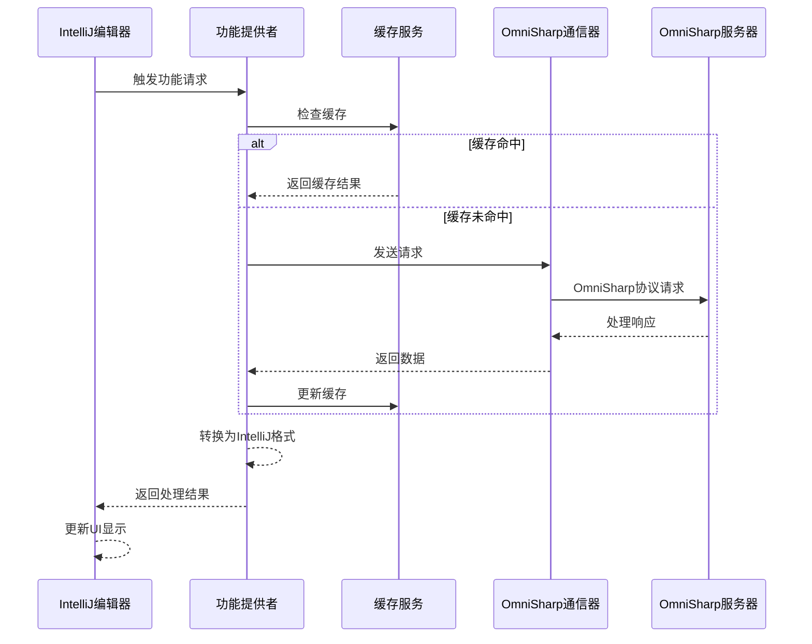
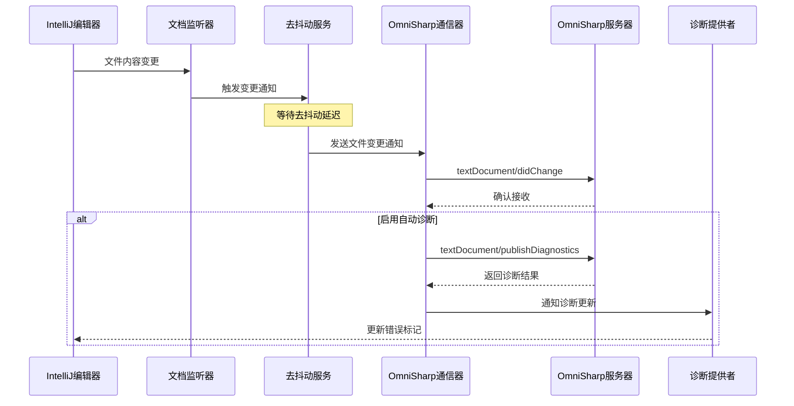

# OmniSharp编辑器功能集成 - 架构设计

## 目录

1. [概述](#概述)
2. [系统架构](#系统架构)
3. [核心组件](#核心组件)
4. [数据模型](#数据模型)
5. [接口设计](#接口设计)
6. [功能模块](#功能模块)
7. [数据流](#数据流)
8. [性能考虑](#性能考虑)
9. [扩展性](#扩展性)
10. [总结](#总结)

## 概述

本文档详细描述OmniSharp编辑器功能集成的架构设计，旨在将OmniSharp服务器提供的代码智能功能（如代码补全、导航、诊断等）无缝集成到IntelliJ平台中。该架构设计提供了一个统一的框架，用于管理OmniSharp与IntelliJ编辑器之间的交互，确保高效、可靠的功能实现。

### 设计目标

- **无缝集成**：将OmniSharp功能自然融入IntelliJ平台的用户体验
- **高性能**：确保编辑器功能的响应速度，不影响用户编码效率
- **可扩展**：提供灵活的架构，支持未来添加更多编辑器功能
- **统一接口**：为所有编辑器功能提供一致的实现模式
- **错误处理**：完善的错误处理机制，确保功能稳定性

## 系统架构

### 高层架构图

```
+--------------------------------+      +----------------------------------+
|                                |      |                                  |
|       IntelliJ 平台编辑器      |      |           OmniSharp 服务器        |
|                                |      |                                  |
+---------------+----------------+      +----------------+------------------+
                |                                             ^
                |  IntelliJ编辑器API      OmniSharp协议     |
                v                                             |
+-----------------------------------------------------------+
|                     编辑器功能集成层                       |
+-----------------------------------------------------------+
        |               |               |               |
        v               v               v               v
+-------------+ +--------------+ +---------------+ +---------------+
| 代码补全模块 | | 代码导航模块 | | 代码诊断模块 | | 代码格式化模块 |
+-------------+ +--------------+ +---------------+ +---------------+
        |               |               |               |
        v               v               v               v
+-----------------------------------------------------------+
|                     通用服务层                             |
+-----------------------------------------------------------+
        |               |               |               |
        v               v               v               v
+-------------+ +--------------+ +---------------+ +---------------+
| 缓存服务    | | 会话管理     | | 配置管理     | | 性能监控     |
+-------------+ +--------------+ +---------------+ +---------------+
```

### 组件层次结构

```
OmniSharpEditorIntegration
├── EditorFeaturesManager
├── Completion
│   ├── OmniSharpCompletionProvider
│   ├── CompletionItemFactory
│   └── CompletionCache
├── Navigation
│   ├── OmniSharpGoToDeclarationHandler
│   ├── OmniSharpFindUsagesHandler
│   ├── OmniSharpReferenceSearcher
│   └── NavigationCache
├── Diagnostics
│   ├── OmniSharpDiagnosticsProvider
│   ├── OmniSharpProblemHighlightFilter
│   └── DiagnosticsCache
├── Formatting
│   ├── OmniSharpCodeStyleSettingsProvider
│   ├── OmniSharpCodeStyleManager
│   └── OmniSharpFormattingProvider
└── Common
    ├── CacheService
    ├── SessionManager
    ├── ConfigurationManager
    ├── PerformanceMonitor
    └── EventBus
```

## 核心组件

### 1. EditorFeaturesManager

EditorFeaturesManager是整个编辑器功能集成的核心管理组件，负责协调各功能模块的初始化、配置和生命周期管理。

**主要职责：**
- 初始化和配置所有编辑器功能模块
- 管理与OmniSharp服务器的会话
- 协调不同功能模块之间的交互
- 处理全局配置和事件
- 提供功能模块的注册和访问机制

### 2. 编辑器功能模块

每个编辑器功能都由专门的模块实现，遵循相似的设计模式但专注于特定功能。

**通用设计模式：**
- 继承IntelliJ相应的扩展点接口
- 与OmniSharp服务器通信获取数据
- 缓存结果提高性能
- 转换OmniSharp数据格式为IntelliJ格式
- 实现相应的UI交互逻辑

### 3. 通用服务层

提供所有功能模块共享的基础服务，确保系统的一致性和可维护性。

**主要服务：**
- **缓存服务**：管理各种编辑器功能的缓存
- **会话管理**：处理与OmniSharp服务器的会话
- **配置管理**：管理用户和系统配置
- **性能监控**：监控功能执行性能
- **事件总线**：处理组件间通信

## 数据模型

### 1. 编辑器功能数据模型

#### 代码补全数据模型

```kotlin
interface OmniSharpCompletionItem {
    val label: String
    val kind: String?
    val detail: String?
    val documentation: String?
    val insertText: String
    val filterText: String?
    val sortText: String?
    val commitCharacters: List<String>?
    val data: Map<String, Any>?
    
    fun toIntelliJItem(): LookupElement
}
```

#### 导航数据模型

```kotlin
interface OmniSharpNavigationItem {
    val fileName: String
    val line: Int
    val column: Int
    val text: String?
    val type: String?
    
    fun toIntelliJNavigationElement(): NavigationItem
}
```

#### 诊断数据模型

```kotlin
interface OmniSharpDiagnostic {
    val range: TextRange
    val severity: DiagnosticSeverity
    val message: String
    val code: String?
    val source: String?
    val actions: List<OmniSharpCodeAction>?
    
    fun toIntelliJHighlightInfo(): HighlightInfo
}
```

### 2. 配置数据模型

```kotlin
interface EditorFeatureConfig {
    val enabled: Boolean
    val timeout: Long
    val cacheSize: Int
    val debounceDelay: Long
    
    fun update(newConfig: Map<String, Any>)
}
```

## 接口设计

### 1. 功能提供者接口

```kotlin
interface EditorFeatureProvider {
    /**
     * 初始化功能提供者
     */
    fun initialize(componentContext: ComponentContext)
    
    /**
     * 是否启用该功能
     */
    fun isEnabled(): Boolean
    
    /**
     * 配置功能
     */
    fun configure(config: Map<String, Any>)
    
    /**
     * 清理资源
     */
    fun dispose()
}
```

### 2. 代码补全接口

```kotlin
interface OmniSharpCompletionService {
    /**
     * 获取代码补全项
     */
    fun getCompletions(project: Project, file: VirtualFile, caretOffset: Int): CompletableFuture<List<OmniSharpCompletionItem>>
    
    /**
     * 处理补全项的选择
     */
    fun handleCompletionItemSelected(item: OmniSharpCompletionItem, editor: Editor)
}
```

### 3. 代码导航接口

```kotlin
interface OmniSharpNavigationService {
    /**
     * 查找声明位置
     */
    fun findDeclaration(project: Project, file: VirtualFile, caretOffset: Int): CompletableFuture<List<OmniSharpNavigationItem>>
    
    /**
     * 查找所有引用
     */
    fun findReferences(project: Project, file: VirtualFile, caretOffset: Int): CompletableFuture<List<OmniSharpNavigationItem>>
    
    /**
     * 查找类型定义
     */
    fun findTypeDefinition(project: Project, file: VirtualFile, caretOffset: Int): CompletableFuture<List<OmniSharpNavigationItem>>
}
```

### 4. 代码诊断接口

```kotlin
interface OmniSharpDiagnosticsService {
    /**
     * 获取文件的诊断信息
     */
    fun getDiagnostics(project: Project, file: VirtualFile): CompletableFuture<List<OmniSharpDiagnostic>>
    
    /**
     * 获取项目的诊断信息
     */
    fun getProjectDiagnostics(project: Project): CompletableFuture<List<OmniSharpDiagnostic>>
    
    /**
     * 刷新诊断信息
     */
    fun refreshDiagnostics(project: Project, file: VirtualFile?)
}
```

### 5. 代码格式化接口

```kotlin
interface OmniSharpFormattingService {
    /**
     * 格式化代码
     */
    fun formatCode(project: Project, file: VirtualFile, range: TextRange?): CompletableFuture<DocumentRange[]>
    
    /**
     * 获取代码风格设置
     */
    fun getCodeStyleSettings(project: Project): CompletableFuture<Map<String, Any>>
    
    /**
     * 应用代码风格设置
     */
    fun applyCodeStyleSettings(project: Project, settings: Map<String, Any>): CompletableFuture<Boolean>
}
```

### 6. 通用服务接口

```kotlin
interface CacheService {
    /**
     * 获取缓存项
     */
    fun <T> get(key: CacheKey<T>): T?
    
    /**
     * 存储缓存项
     */
    fun <T> put(key: CacheKey<T>, value: T)
    
    /**
     * 移除缓存项
     */
    fun <T> remove(key: CacheKey<T>)
    
    /**
     * 清理缓存
     */
    fun clear(prefix: String? = null)
}

interface SessionManager {
    /**
     * 获取会话
     */
    fun getSession(project: Project): OmniSharpSession?
    
    /**
     * 创建会话
     */
    fun createSession(project: Project): OmniSharpSession
    
    /**
     * 关闭会话
     */
    fun closeSession(project: Project)
}

interface ConfigurationManager {
    /**
     * 获取配置
     */
    fun <T> getConfiguration(key: String, defaultValue: T): T
    
    /**
     * 设置配置
     */
    fun <T> setConfiguration(key: String, value: T)
    
    /**
     * 加载配置
     */
    fun loadConfiguration()
    
    /**
     * 保存配置
     */
    fun saveConfiguration()
}

interface PerformanceMonitor {
    /**
     * 开始性能计时
     */
    fun startOperation(operationName: String): PerformanceOperation
    
    /**
     * 记录性能数据
     */
    fun recordOperation(operationName: String, durationMs: Long, success: Boolean)
    
    /**
     * 获取性能统计
     */
    fun getPerformanceStatistics(): Map<String, PerformanceStatistics>
}
```

## 功能模块

### 1. 代码补全模块

代码补全模块负责提供智能代码补全功能，与IntelliJ的代码补全系统集成。

**主要组件：**
- **OmniSharpCompletionProvider**：实现IntelliJ的CompletionProvider接口，提供补全项
- **CompletionItemFactory**：将OmniSharp补全数据转换为IntelliJ补全项
- **CompletionCache**：缓存补全结果提高性能
- **CompletionHandler**：处理用户选择补全项的逻辑

**工作流程：**
1. 用户在编辑器中触发补全（如输入点、空格等）
2. IntelliJ调用OmniSharpCompletionProvider
3. 收集当前文件、位置、上下文信息
4. 向OmniSharp服务器发送补全请求
5. 缓存结果并转换为IntelliJ格式
6. 显示补全列表给用户
7. 处理用户选择，应用补全

### 2. 代码导航模块

代码导航模块实现代码定义查找、引用查找等导航功能。

**主要组件：**
- **OmniSharpGoToDeclarationHandler**：实现声明跳转功能
- **OmniSharpFindUsagesHandler**：实现查找引用功能
- **OmniSharpReferenceSearcher**：实现引用搜索功能
- **NavigationCache**：缓存导航结果

**工作流程：**
1. 用户触发导航操作（如Ctrl+点击、右键菜单）
2. 相应的Handler收集当前文件、位置信息
3. 向OmniSharp服务器发送导航请求
4. 处理响应，转换为IntelliJ的导航目标
5. 执行导航操作（跳转或显示结果窗口）

### 3. 代码诊断模块

代码诊断模块负责提供实时代码分析和错误标记功能。

**主要组件：**
- **OmniSharpDiagnosticsProvider**：提供代码诊断信息
- **OmniSharpProblemHighlightFilter**：定义哪些问题需要高亮
- **DiagnosticsCache**：缓存诊断结果
- **DiagnosticsUpdater**：定期或在文件更改时更新诊断

**工作流程：**
1. 文件保存或更改时触发诊断
2. 向OmniSharp服务器发送诊断请求
3. 处理响应，生成错误和警告标记
4. 在编辑器中高亮显示问题
5. 提供快速修复建议（如果有）

### 4. 代码格式化模块

代码格式化模块负责提供代码格式化功能，保持代码风格一致性。

**主要组件：**
- **OmniSharpCodeStyleSettingsProvider**：提供代码风格设置UI
- **OmniSharpCodeStyleManager**：管理代码风格设置
- **OmniSharpFormattingProvider**：实现代码格式化功能
- **FormattingCache**：缓存格式化配置

**工作流程：**
1. 用户触发格式化操作（如快捷键、保存时格式化）
2. 收集当前文件、选择范围信息
3. 向OmniSharp服务器发送格式化请求
4. 处理响应，应用格式化到编辑器

## 数据流

### 编辑器功能请求流程



### 文件变更同步流程



## 性能考虑

### 1. 缓存策略

- **多级缓存**：实现内存缓存和文件缓存
- **缓存失效机制**：基于文件修改时间、内容哈希等
- **预缓存**：预测可能需要的数据并提前缓存
- **缓存限制**：设置合理的缓存大小和过期时间

### 2. 请求优化

- **请求去抖动**：合并短时间内的相似请求
- **批量处理**：将多个小请求合并为一个批量请求
- **请求优先级**：为重要操作设置更高优先级
- **异步处理**：避免阻塞UI线程

### 3. 响应处理

- **增量更新**：只处理和显示变化的部分
- **后台处理**：在后台线程处理数据转换和UI更新
- **延迟加载**：按需加载详细信息
- **进度反馈**：为长时间操作提供进度指示

## 扩展性

### 1. 插件机制

系统设计支持通过插件机制扩展功能：

- **自定义功能提供者**：实现EditorFeatureProvider接口
- **自定义数据转换器**：扩展默认的数据转换逻辑
- **自定义缓存策略**：实现特定需求的缓存机制
- **自定义UI组件**：为功能提供自定义UI

### 2. 配置扩展

提供灵活的配置扩展机制：

- **项目级配置**：特定项目的自定义设置
- **文件级配置**：特定文件的特殊处理
- **用户偏好**：基于用户习惯的个性化配置
- **动态配置**：运行时调整的配置项

## 总结

本文档详细描述了OmniSharp编辑器功能集成的架构设计，包括系统架构、核心组件、接口设计、功能模块和数据流等方面。该架构设计提供了一个完整的框架，用于将OmniSharp服务器的各种编辑器功能无缝集成到IntelliJ平台中，确保良好的用户体验和高性能。

主要特点：

- **模块化设计**：各功能模块独立实现，便于维护和扩展
- **统一接口**：提供一致的接口和行为模式
- **性能优化**：通过缓存、去抖动等机制优化性能
- **错误处理**：完善的错误处理和恢复机制
- **扩展性强**：支持插件扩展和配置扩展

通过这一架构设计，我们可以构建一个高效、稳定、功能丰富的OmniSharp编辑器功能集成系统，为IntelliJ平台上的C#开发提供优质的编辑体验。