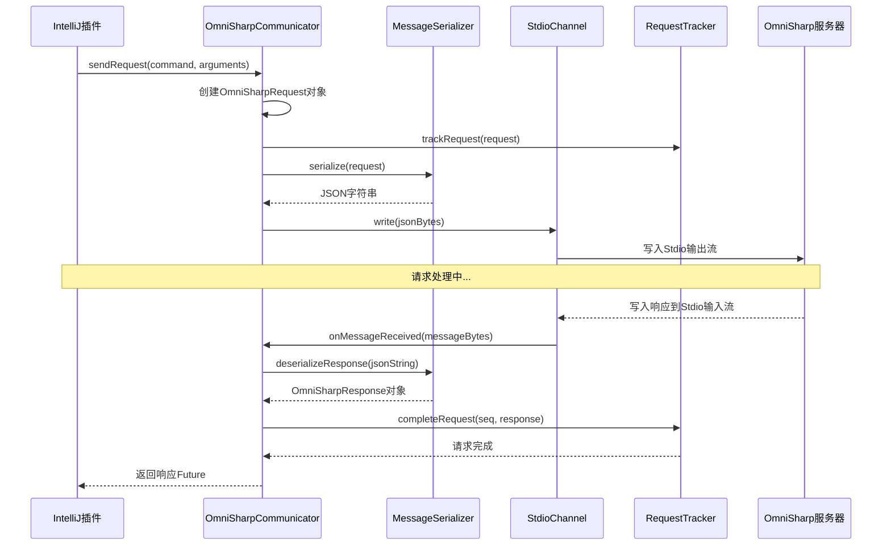
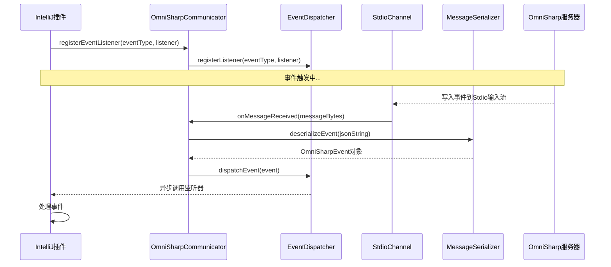
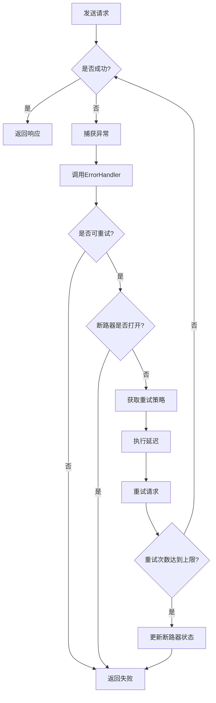

# OmniSharp通信协议实现文档

## 目录

1. [概述](#概述)
2. [系统架构与组件关系](#系统架构与组件关系)
3. [核心组件实现](#核心组件实现)
4. [通信流程](#通信流程)
5. [错误处理与重试机制](#错误处理与重试机制)
6. [代码示例](#代码示例)
7. [性能优化](#性能优化)
8. [扩展性考虑](#扩展性考虑)
9. [部署与配置](#部署与配置)
10. [总结](#总结)

## 概述

本文档详细描述OmniSharp通信协议的实现方案，包括系统架构、核心组件实现、通信流程、错误处理、代码示例和性能优化建议。OmniSharp通信协议是IntelliJ平台与OmniSharp服务器之间的桥梁，负责消息的序列化、传输和处理，支持请求-响应模式和事件通知机制。

### 协议特点

- **基于JSON**：使用JSON格式进行消息序列化，易于解析和调试
- **基于Stdio**：使用标准输入输出流进行进程间通信，稳定可靠
- **支持异步通信**：采用非阻塞的异步通信模式，提高性能
- **完善的错误处理**：包含异常捕获、重试机制和断路器模式
- **灵活的扩展点**：提供多个接口，支持自定义实现和测试

## 系统架构与组件关系

### 系统架构图

```
+----------------------------------+      +-----------------------------------+
|                                  |      |                                   |
|        IntelliJ 平台插件         |      |         OmniSharp 服务器         |
|                                  |      |                                   |
+---------------+------------------+      +----------------+------------------+
                |                                             ^
                |  Stdio通信                                  |
                v                                             |
+-----------------------------------------------------------+
|                        通信协议层                          |
+-----------------------------------------------------------+
        |               |               |               |
        v               v               v               v
+-------------+ +--------------+ +---------------+ +---------------+
| 消息序列化层 | | Stdio通信管道 | | 请求-响应机制 | | 事件处理机制 |
+-------------+ +--------------+ +---------------+ +---------------+
        |               |               |               |
        v               v               v               v
+-----------------------------------------------------------+
|                    错误处理与重试机制                      |
+-----------------------------------------------------------+
```

### 组件层次关系

```
┌─────────────────────────────────┐
│         IOmniSharpCommunicator  │ ← 通信管理器接口
└─────────┬───────────────────────┘
          │
┌─────────▼───────────────────────┐
│   OmniSharpCommunicator         │ ← 通信管理器实现
└─────────┬───────────────────────┘
          │
  ┌───────┼───────┐
  │       │       │
  v       v       v
┌────────┐┌────────┐┌────────┐
│ IMessage │ IStdioChannel │ IRequestTracker │ ← 核心接口
│ Serializer│              │                 │
└────┬───┘└────┬───┘└──────┬┘
     │          │           │
┌────▼───┐┌────▼───┐┌──────▼┐
│Jackson ││Stdio   ││Request│ ← 具体实现
│Serializer│Channel│Tracker│
└────────┘└────────┘└───────┘
          │
   ┌──────┴──────┐
   v             v
┌────────┐    ┌────────┐
│IEventDispatcher│    │ErrorHandler│ ← 扩展接口
└────┬───┘    └────┬───┘
     │             │
┌────▼───┐    ┌────▼───┐
│Event   │    │Default │ ← 具体实现
│Dispatcher│    │ErrorHandler│
└────────┘    └────────┘
```

## 核心组件实现

### 1. 消息序列化/反序列化

#### IMessageSerializer接口

```kotlin
interface IMessageSerializer {
    /**
     * 将对象序列化为JSON字符串
     * @param message 要序列化的对象
     * @return 序列化后的JSON字符串
     * @throws MessageParseException 如果序列化失败
     */
    fun serialize(message: Any): String
    
    /**
     * 将JSON字符串反序列化为OmniSharpRequest对象
     * @param json JSON字符串
     * @return OmniSharpRequest对象
     * @throws MessageParseException 如果反序列化失败
     */
    fun deserializeRequest(json: String): OmniSharpRequest
    
    /**
     * 将JSON字符串反序列化为OmniSharpResponse对象
     * @param json JSON字符串
     * @return OmniSharpResponse对象
     * @throws MessageParseException 如果反序列化失败
     */
    fun deserializeResponse(json: String): OmniSharpResponse
    
    /**
     * 将JSON字符串反序列化为OmniSharpEvent对象
     * @param json JSON字符串
     * @return OmniSharpEvent对象
     * @throws MessageParseException 如果反序列化失败
     */
    fun deserializeEvent(json: String): OmniSharpEvent
}
```

#### JacksonMessageSerializer实现

```kotlin
class JacksonMessageSerializer(private val objectMapper: ObjectMapper = ObjectMapper()) : IMessageSerializer {
    init {
        // 配置Jackson
        objectMapper.configure(DeserializationFeature.FAIL_ON_UNKNOWN_PROPERTIES, false)
        objectMapper.setSerializationInclusion(Include.NON_NULL)
        objectMapper.registerModule(KotlinModule())
    }
    
    override fun serialize(message: Any): String {
        try {
            return objectMapper.writeValueAsString(message)
        } catch (e: Exception) {
            throw MessageParseException("Failed to serialize message: ${e.message}", e)
        }
    }
    
    override fun deserializeRequest(json: String): OmniSharpRequest {
        try {
            return objectMapper.readValue(json, OmniSharpRequest::class.java)
        } catch (e: Exception) {
            throw MessageParseException("Failed to deserialize request: ${e.message}", e)
        }
    }
    
    override fun deserializeResponse(json: String): OmniSharpResponse {
        try {
            return objectMapper.readValue(json, OmniSharpResponse::class.java)
        } catch (e: Exception) {
            throw MessageParseException("Failed to deserialize response: ${e.message}", e)
        }
    }
    
    override fun deserializeEvent(json: String): OmniSharpEvent {
        try {
            return objectMapper.readValue(json, OmniSharpEvent::class.java)
        } catch (e: Exception) {
            throw MessageParseException("Failed to deserialize event: ${e.message}", e)
        }
    }
}
```

### 2. Stdio通信管道

#### IStdioChannel接口

```kotlin
interface IStdioChannel {
    /**
     * 初始化通道
     * @param process 外部进程
     */
    fun initialize(process: Process)
    
    /**
     * 向进程写入消息
     * @param message 消息字节数组
     * @throws IOException 如果写入失败
     */
    fun write(message: ByteArray)
    
    /**
     * 从进程读取消息
     * @return 消息字节数组
     * @throws IOException 如果读取失败
     * @throws TimeoutException 如果读取超时
     */
    fun read(): ByteArray
    
    /**
     * 关闭通道并释放资源
     */
    fun close()
    
    /**
     * 注册消息监听器
     * @param listener 消息监听器
     */
    fun registerListener(listener: IStdioMessageListener)
    
    /**
     * 取消注册消息监听器
     * @param listener 消息监听器
     */
    fun unregisterListener(listener: IStdioMessageListener)
}
```

#### StdioChannel实现

```kotlin
class StdioChannel : IStdioChannel {
    private lateinit var inputStream: BufferedInputStream
    private lateinit var outputStream: BufferedOutputStream
    private lateinit var errorStream: BufferedReader
    private val listeners = CopyOnWriteArrayList<IStdioMessageListener>()
    private val mutex = ReentrantLock()
    private val condition = mutex.newCondition()
    private val responseBuffers = ConcurrentHashMap<Int, ByteArrayOutputStream>()
    private var isReading = false
    private var isInitialized = false
    
    override fun initialize(process: Process) {
        mutex.lock()
        try {
            if (isInitialized) return
            
            inputStream = BufferedInputStream(process.inputStream)
            outputStream = BufferedOutputStream(process.outputStream)
            errorStream = BufferedReader(InputStreamReader(process.errorStream))
            
            // 启动错误流读取线程
            Thread(this::readErrorStream, "OmniSharp-ErrorStream").start()
            
            // 启动消息读取线程
            Thread(this::readMessageStream, "OmniSharp-MessageStream").start()
            
            isInitialized = true
        } finally {
            mutex.unlock()
        }
    }
    
    override fun write(message: ByteArray) {
        mutex.lock()
        try {
            checkInitialized()
            outputStream.write(message)
            outputStream.write("\r\n".toByteArray())
            outputStream.flush()
        } finally {
            mutex.unlock()
        }
    }
    
    override fun read(): ByteArray {
        mutex.lock()
        try {
            checkInitialized()
            
            // 等待消息到达
            if (responseBuffers.isEmpty()) {
                condition.await(30, TimeUnit.SECONDS) // 30秒超时
                if (responseBuffers.isEmpty()) {
                    throw TimeoutException("No response received within timeout period")
                }
            }
            
            // 获取第一个可用的响应
            val entry = responseBuffers.entries.first()
            responseBuffers.remove(entry.key)
            return entry.value.toByteArray()
        } finally {
            mutex.unlock()
        }
    }
    
    private fun readMessageStream() {
        isReading = true
        try {
            val buffer = ByteArray(8192)
            var bytesRead: Int
            var contentLength = -1
            val messageBuffer = ByteArrayOutputStream()
            var contentRead = 0
            
            while (isReading && inputStream.read(buffer).also { bytesRead = it } != -1) {
                var position = 0
                
                // 处理读取的数据
                while (position < bytesRead) {
                    if (contentLength == -1) {
                        // 寻找Content-Length头
                        val lineEnd = findLineEnd(buffer, position, bytesRead)
                        if (lineEnd >= 0) {
                            val line = String(buffer, position, lineEnd - position).trim()
                            position = lineEnd + 2 // 跳过CRLF
                            
                            if (line.startsWith("Content-Length:")) {
                                contentLength = line.substring("Content-Length:".length).trim().toInt()
                            } else if (line.isEmpty()) {
                                // 空行表示头部结束
                                if (contentLength > 0) {
                                    // 准备读取消息体
                                    messageBuffer.reset()
                                    contentRead = 0
                                }
                            }
                        } else {
                            // 没有找到行结束符，继续读取
                            position = bytesRead
                        }
                    } else {
                        // 读取消息体
                        val bytesToRead = Math.min(bytesRead - position, contentLength - contentRead)
                        messageBuffer.write(buffer, position, bytesToRead)
                        contentRead += bytesToRead
                        position += bytesToRead
                        
                        if (contentRead >= contentLength) {
                            // 消息完整，处理消息
                            val messageBytes = messageBuffer.toByteArray()
                            processMessage(messageBytes)
                            
                            // 重置状态
                            contentLength = -1
                            contentRead = 0
                            messageBuffer.reset()
                        }
                    }
                }
            }
        } catch (e: Exception) {
            notifyError(e)
        } finally {
            isReading = false
        }
    }
    
    private fun processMessage(messageBytes: ByteArray) {
        try {
            // 解析消息获取seq
            val messageJson = String(messageBytes, StandardCharsets.UTF_8)
            val jsonObject = JsonParser.parseString(messageJson).asJsonObject
            
            // 根据消息类型进行处理
            if (jsonObject.has("event")) {
                // 事件消息，分发给所有监听器
                notifyEvent(messageBytes)
            } else if (jsonObject.has("request_seq")) {
                // 响应消息，存储到响应缓冲区
                val requestSeq = jsonObject.get("request_seq").asInt
                mutex.lock()
                try {
                    responseBuffers[requestSeq] = ByteArrayOutputStream().apply { write(messageBytes) }
                    condition.signalAll()
                } finally {
                    mutex.unlock()
                }
            }
        } catch (e: Exception) {
            notifyError(e)
        }
    }
    
    private fun readErrorStream() {
        try {
            var line: String?
            while (errorStream.readLine().also { line = it } != null) {
                // 处理错误输出
                notifyError(IOException("OmniSharp error output: $line"))
            }
        } catch (e: IOException) {
            // 错误流关闭
        }
    }
    
    private fun findLineEnd(buffer: ByteArray, start: Int, end: Int): Int {
        for (i in start until end - 1) {
            if (buffer[i] == '\r'.toByte() && buffer[i + 1] == '\n'.toByte()) {
                return i
            }
        }
        return -1
    }
    
    private fun checkInitialized() {
        if (!isInitialized) {
            throw IllegalStateException("StdioChannel is not initialized")
        }
    }
    
    private fun notifyEvent(message: ByteArray) {
        for (listener in listeners) {
            try {
                listener.onMessageReceived(message)
            } catch (e: Exception) {
                // 单个监听器异常不应影响其他监听器
                println("Error in message listener: ${e.message}")
            }
        }
    }
    
    private fun notifyError(error: Throwable) {
        for (listener in listeners) {
            try {
                listener.onError(error)
            } catch (e: Exception) {
                // 单个监听器异常不应影响其他监听器
                println("Error in error listener: ${e.message}")
            }
        }
    }
    
    override fun close() {
        mutex.lock()
        try {
            isReading = false
            
            try {
                outputStream.close()
                inputStream.close()
                errorStream.close()
            } catch (e: Exception) {
                // 忽略关闭异常
            }
            
            responseBuffers.clear()
            listeners.clear()
            isInitialized = false
        } finally {
            mutex.unlock()
        }
    }
    
    override fun registerListener(listener: IStdioMessageListener) {
        listeners.add(listener)
    }
    
    override fun unregisterListener(listener: IStdioMessageListener) {
        listeners.remove(listener)
    }
}
```

### 3. 请求-响应模式

#### IRequestTracker接口

```kotlin
interface IRequestTracker {
    /**
     * 跟踪请求
     * @param request 请求对象
     * @param timeoutMs 超时时间（毫秒），默认30秒
     */
    fun trackRequest(request: OmniSharpRequest, timeoutMs: Long = 30000)
    
    /**
     * 获取请求
     * @param seq 请求序列号
     * @return 请求对象，如果不存在则返回null
     */
    fun getRequest(seq: Int): OmniSharpRequest?
    
    /**
     * 完成请求
     * @param seq 请求序列号
     * @param response 响应对象
     * @return 请求对象，如果不存在则返回null
     */
    fun completeRequest(seq: Int, response: OmniSharpResponse): OmniSharpRequest?
    
    /**
     * 取消请求
     * @param seq 请求序列号
     * @return 请求对象，如果不存在则返回null
     */
    fun cancelRequest(seq: Int): OmniSharpRequest?
    
    /**
     * 检查是否有指定序列号的请求
     * @param seq 请求序列号
     * @return 如果有则返回true
     */
    fun hasRequest(seq: Int): Boolean
    
    /**
     * 清除所有请求
     */
    fun clear()
}
```

#### RequestTracker实现

```kotlin
class RequestTracker : IRequestTracker {
    private val requests = ConcurrentHashMap<Int, TrackedRequest>()
    private val timeoutExecutor = Executors.newScheduledThreadPool(1)
    private var nextSeq = 1
    private val maxRequests = 1000
    
    override fun trackRequest(request: OmniSharpRequest, timeoutMs: Long) {
        // 检查请求数量限制
        if (requests.size >= maxRequests) {
            throw IllegalStateException("Maximum number of tracked requests reached: $maxRequests")
        }
        
        // 如果请求没有序列号，则分配一个
        val seq = if (request.seq == 0) nextSeq++ else request.seq
        
        // 创建跟踪的请求
        val trackedRequest = TrackedRequest(request, seq)
        requests[seq] = trackedRequest
        
        // 设置超时任务
        if (timeoutMs > 0) {
            timeoutExecutor.schedule({
                handleTimeout(seq)
            }, timeoutMs, TimeUnit.MILLISECONDS)
        }
    }
    
    override fun getRequest(seq: Int): OmniSharpRequest? {
        return requests[seq]?.request
    }
    
    override fun completeRequest(seq: Int, response: OmniSharpResponse): OmniSharpRequest? {
        val trackedRequest = requests.remove(seq)
        if (trackedRequest != null) {
            trackedRequest.complete(response)
        }
        return trackedRequest?.request
    }
    
    override fun cancelRequest(seq: Int): OmniSharpRequest? {
        val trackedRequest = requests.remove(seq)
        if (trackedRequest != null) {
            trackedRequest.cancel()
        }
        return trackedRequest?.request
    }
    
    override fun hasRequest(seq: Int): Boolean {
        return requests.containsKey(seq)
    }
    
    override fun clear() {
        // 取消所有请求
        for (seq in requests.keys.toList()) {
            cancelRequest(seq)
        }
    }
    
    private fun handleTimeout(seq: Int) {
        val trackedRequest = requests[seq]
        if (trackedRequest != null) {
            // 请求仍在跟踪中，取消它
            cancelRequest(seq)
        }
    }
    
    /**
     * 内部类：跟踪的请求
     */
    private inner class TrackedRequest(val request: OmniSharpRequest, val seq: Int) {
        private val responseFuture = CompletableFuture<OmniSharpResponse>()
        
        fun complete(response: OmniSharpResponse) {
            responseFuture.complete(response)
        }
        
        fun cancel() {
            responseFuture.cancel(true)
        }
        
        fun getResponse(timeout: Long, unit: TimeUnit): OmniSharpResponse {
            return responseFuture.get(timeout, unit)
        }
    }
    
    /**
     * 获取请求的响应Future
     */
    fun getResponseFuture(seq: Int): CompletableFuture<OmniSharpResponse>? {
        val trackedRequest = requests[seq]
        return if (trackedRequest != null) {
            // 创建一个新的Future以避免外部访问内部实现
            CompletableFuture.supplyAsync { 
                try {
                    trackedRequest.getResponse(30, TimeUnit.SECONDS)
                } catch (e: Exception) {
                    throw CompletionException(e)
                }
            }
        } else {
            null
        }
    }
}
```

### 4. 事件处理机制

#### IEventDispatcher接口

```kotlin
interface IEventDispatcher {
    /**
     * 注册事件监听器
     * @param eventType 事件类型
     * @param listener 事件监听器
     */
    fun registerListener(eventType: String, listener: EventListener)
    
    /**
     * 取消注册事件监听器
     * @param eventType 事件类型
     * @param listener 事件监听器
     */
    fun unregisterListener(eventType: String, listener: EventListener)
    
    /**
     * 分发事件
     * @param event 事件对象
     */
    fun dispatchEvent(event: OmniSharpEvent)
    
    /**
     * 事件监听器接口
     */
    interface EventListener {
        /**
         * 处理事件
         * @param event 事件对象
         */
        fun onEvent(event: OmniSharpEvent)
    }
}
```

#### EventDispatcher实现

```kotlin
class EventDispatcher : IEventDispatcher {
    private val listeners = ConcurrentHashMap<String, CopyOnWriteArrayList<IEventDispatcher.EventListener>>()
    private val executorService = Executors.newFixedThreadPool(Runtime.getRuntime().availableProcessors())
    
    override fun registerListener(eventType: String, listener: IEventDispatcher.EventListener) {
        if (listener == null) {
            throw IllegalArgumentException("Listener cannot be null")
        }
        
        val eventListeners = listeners.computeIfAbsent(eventType) { CopyOnWriteArrayList() }
        eventListeners.add(listener)
    }
    
    override fun unregisterListener(eventType: String, listener: IEventDispatcher.EventListener) {
        val eventListeners = listeners[eventType]
        if (eventListeners != null) {
            eventListeners.remove(listener)
            
            // 如果没有监听器了，移除该事件类型
            if (eventListeners.isEmpty()) {
                listeners.remove(eventType)
            }
        }
    }
    
    override fun dispatchEvent(event: OmniSharpEvent) {
        val eventType = event.event
        val eventListeners = listeners[eventType]
        
        if (eventListeners != null && !eventListeners.isEmpty()) {
            // 异步分发事件
            for (listener in eventListeners) {
                executorService.submit {
                    try {
                        listener.onEvent(event)
                    } catch (e: Exception) {
                        // 记录异常但不影响其他监听器
                        println("Exception in event listener for $eventType: ${e.message}")
                        e.printStackTrace()
                    }
                }
            }
        }
    }
    
    /**
     * 关闭事件分发器并释放资源
     */
    fun shutdown() {
        executorService.shutdown()
        try {
            if (!executorService.awaitTermination(5, TimeUnit.SECONDS)) {
                executorService.shutdownNow()
            }
        } catch (e: InterruptedException) {
            executorService.shutdownNow()
        }
        listeners.clear()
    }
}
```

### 5. 通信管理器

#### IOmniSharpCommunicator接口

```kotlin
interface IOmniSharpCommunicator {
    /**
     * 初始化通信器
     * @param process OmniSharp进程
     */
    fun initialize(process: Process)
    
    /**
     * 发送请求并获取响应
     * @param command 命令名称
     * @param arguments 命令参数
     * @return 响应的CompletableFuture
     */
    fun sendRequest(command: String, arguments: Map<String, Any>): CompletableFuture<OmniSharpResponse>
    
    /**
     * 发送请求并获取响应
     * @param command 命令名称
     * @param arguments 命令参数
     * @param timeoutMs 超时时间（毫秒）
     * @return 响应的CompletableFuture
     */
    fun sendRequest(command: String, arguments: Map<String, Any>, timeoutMs: Long): CompletableFuture<OmniSharpResponse>
    
    /**
     * 注册事件监听器
     * @param eventType 事件类型
     * @param listener 事件监听器
     */
    fun registerEventListener(eventType: String, listener: IEventDispatcher.EventListener)
    
    /**
     * 取消注册事件监听器
     * @param eventType 事件类型
     * @param listener 事件监听器
     */
    fun unregisterEventListener(eventType: String, listener: IEventDispatcher.EventListener)
    
    /**
     * 关闭通信器并释放资源
     */
    fun shutdown()
}
```

#### OmniSharpCommunicator实现

```kotlin
class OmniSharpCommunicator(
    private val stdioChannel: IStdioChannel,
    private val messageSerializer: IMessageSerializer,
    private val requestTracker: IRequestTracker,
    private val eventDispatcher: IEventDispatcher
) : IOmniSharpCommunicator, IStdioMessageListener {
    private var isInitialized = false
    private val mutex = ReentrantLock()
    
    override fun initialize(process: Process) {
        mutex.lock()
        try {
            if (isInitialized) return
            
            stdioChannel.initialize(process)
            stdioChannel.registerListener(this)
            isInitialized = true
        } finally {
            mutex.unlock()
        }
    }
    
    override fun sendRequest(command: String, arguments: Map<String, Any>): CompletableFuture<OmniSharpResponse> {
        return sendRequest(command, arguments, 30000) // 默认30秒超时
    }
    
    override fun sendRequest(command: String, arguments: Map<String, Any>, timeoutMs: Long): CompletableFuture<OmniSharpResponse> {
        mutex.lock()
        try {
            checkInitialized()
            
            // 创建请求对象
            val request = OmniSharpRequest(
                command = command,
                arguments = arguments,
                type = "request"
            )
            
            // 跟踪请求
            requestTracker.trackRequest(request, timeoutMs)
            
            // 序列化请求
            val requestJson = messageSerializer.serialize(request)
            
            // 写入请求到Stdio通道
            stdioChannel.write(requestJson.toByteArray(StandardCharsets.UTF_8))
            
            // 返回响应Future
            return requestTracker.getResponseFuture(request.seq) ?: 
                CompletableFuture.failedFuture(IllegalStateException("Failed to get response future"))
        } catch (e: Exception) {
            return CompletableFuture.failedFuture(e)
        } finally {
            mutex.unlock()
        }
    }
    
    override fun registerEventListener(eventType: String, listener: IEventDispatcher.EventListener) {
        eventDispatcher.registerListener(eventType, listener)
    }
    
    override fun unregisterEventListener(eventType: String, listener: IEventDispatcher.EventListener) {
        eventDispatcher.unregisterListener(eventType, listener)
    }
    
    override fun shutdown() {
        mutex.lock()
        try {
            if (!isInitialized) return
            
            stdioChannel.unregisterListener(this)
            stdioChannel.close()
            requestTracker.clear()
            
            if (eventDispatcher is EventDispatcher) {
                eventDispatcher.shutdown()
            }
            
            isInitialized = false
        } finally {
            mutex.unlock()
        }
    }
    
    override fun onMessageReceived(message: ByteArray) {
        try {
            // 解析消息
            val messageJson = String(message, StandardCharsets.UTF_8)
            
            // 判断消息类型
            if (messageJson.contains("\"event\"")) {
                // 事件消息
                val event = messageSerializer.deserializeEvent(messageJson)
                eventDispatcher.dispatchEvent(event)
            } else if (messageJson.contains("\"request_seq\"")) {
                // 响应消息
                val response = messageSerializer.deserializeResponse(messageJson)
                requestTracker.completeRequest(response.request_seq, response)
            }
        } catch (e: Exception) {
            // 处理消息解析或分发异常
            println("Error processing received message: ${e.message}")
        }
    }
    
    override fun onError(error: Throwable) {
        // 处理通道错误
        println("Stdio channel error: ${error.message}")
        // 可以在这里添加更复杂的错误处理逻辑
    }
    
    private fun checkInitialized() {
        if (!isInitialized) {
            throw IllegalStateException("Communicator is not initialized")
        }
    }
}
```

## 通信流程

### 请求-响应流程

以下是一个典型的请求-响应流程，从客户端发送请求到接收响应的完整过程：



### 事件处理流程

以下是OmniSharp服务器发送事件，客户端接收并处理事件的流程：



### 错误处理流程

以下是通信过程中发生错误时的处理流程，包括重试机制和断路器：



## 错误处理与重试机制

### 错误处理架构

OmniSharp通信协议实现了多层错误处理机制，包括：

1. **组件级异常捕获**：每个组件捕获自己的异常并转换为标准格式
2. **统一错误处理器**：处理所有组件抛出的异常
3. **重试机制**：对可重试的错误进行自动重试
4. **断路器模式**：防止在服务不稳定时连续重试导致雪崩

### 重试策略

实现了多种重试策略：

1. **指数退避策略**：每次重试的延迟时间呈指数增长
2. **固定延迟策略**：每次重试使用固定的延迟时间
3. **线性退避策略**：延迟时间线性增长
4. **复合策略**：结合多种策略的优势

### 断路器实现

断路器模式的实现包含三种状态：

1. **关闭状态(CLOSED)**：正常工作状态，请求正常发送
2. **打开状态(OPEN)**：拒绝所有请求，防止服务雪崩
3. **半开状态(HALF_OPEN)**：允许少量请求通过，测试服务是否恢复

## 代码示例

### 1. 基本使用示例

以下是使用OmniSharp通信协议的基本示例：

```kotlin
fun main() {
    // 启动OmniSharp服务器
    val processBuilder = ProcessBuilder("path/to/omnisharp/OmniSharp.exe", "-lsp")
    val process = processBuilder.start()
    
    try {
        // 创建通信组件
        val stdioChannel = StdioChannel()
        val messageSerializer = JacksonMessageSerializer()
        val requestTracker = RequestTracker()
        val eventDispatcher = EventDispatcher()
        val communicator = OmniSharpCommunicator(stdioChannel, messageSerializer, requestTracker, eventDispatcher)
        
        // 初始化通信器
        communicator.initialize(process)
        
        // 注册事件监听器
        communicator.registerEventListener("diagnostics") { event ->
            println("Received diagnostics event: ${event.body}")
        }
        
        // 发送初始化请求
        val initResponse = communicator.sendRequest(
            "initialize",
            mapOf(
                "rootPath" to "/path/to/project",
                "capabilities" to mapOf<String, Any>()
            )
        ).get(5, TimeUnit.SECONDS)
        
        println("Initialize response: ${initResponse.success}")
        
        // 发送代码补全请求
        val completionResponse = communicator.sendRequest(
            "completion",
            mapOf(
                "FileName" to "/path/to/project/Program.cs",
                "Line" to 10,
                "Column" to 5
            )
        ).get(5, TimeUnit.SECONDS)
        
        println("Completion response: ${completionResponse.body}")
        
        // 关闭通信器
        communicator.shutdown()
    } finally {
        // 终止进程
        process.destroy()
    }
}
```

### 2. 带错误处理和重试的使用示例

以下是使用带有错误处理和重试机制的通信器示例：

```kotlin
fun main() {
    // 启动OmniSharp服务器
    val processBuilder = ProcessBuilder("path/to/omnisharp/OmniSharp.exe", "-lsp")
    val process = processBuilder.start()
    
    try {
        // 创建基本通信组件
        val stdioChannel = StdioChannel()
        val messageSerializer = JacksonMessageSerializer()
        val requestTracker = RequestTracker()
        val eventDispatcher = EventDispatcher()
        val baseCommunicator = OmniSharpCommunicator(stdioChannel, messageSerializer, requestTracker, eventDispatcher)
        
        // 创建错误处理器和重试策略
        val errorHandler = DefaultErrorHandler()
        val retryStrategy = ExponentialBackoffRetryStrategy(
            maxRetries = 3,
            initialDelayMs = 100,
            maxDelayMs = 2000,
            jitterFactor = 0.1
        )
        
        // 创建断路器
        val circuitBreaker = CircuitBreaker(
            failureThreshold = 5,
            resetTimeoutMs = 10000
        )
        
        // 创建带重试的通信器
        val retryableCommunicator = RetryableCommunicator(
            baseCommunicator = baseCommunicator,
            errorHandler = errorHandler,
            retryStrategy = retryStrategy,
            circuitBreaker = circuitBreaker
        )
        
        // 初始化通信器
        retryableCommunicator.initialize(process)
        
        // 注册错误监听器
        retryableCommunicator.addErrorListener {
            println("Communication error: ${it.message}")
        }
        
        // 发送请求
        val response = retryableCommunicator.sendRequest(
            "projects",
            emptyMap()
        ).get(30, TimeUnit.SECONDS)
        
        println("Projects response: ${response.body}")
        
        // 关闭通信器
        retryableCommunicator.shutdown()
    } catch (e: Exception) {
        println("Operation failed: ${e.message}")
    } finally {
        // 终止进程
        process.destroy()
    }
}
```

### 3. 异步处理示例

以下是使用异步方式处理多个请求的示例：

```kotlin
fun main() {
    // 启动OmniSharp服务器并初始化通信器（省略部分代码，与前面示例类似）
    val communicator = createAndInitializeCommunicator()
    
    try {
        // 并发发送多个请求
        val requests = listOf(
            async { 
                communicator.sendRequest("projects", emptyMap()).get(5, TimeUnit.SECONDS) 
            },
            async { 
                communicator.sendRequest("v2/getcodeactions", mapOf(
                    "FileName" to "/path/to/file.cs",
                    "Line" to 10,
                    "Column" to 5
                )).get(5, TimeUnit.SECONDS)
            },
            async { 
                communicator.sendRequest("v2/getcompletionlist", mapOf(
                    "FileName" to "/path/to/file.cs",
                    "Line" to 10,
                    "Column" to 5
                )).get(5, TimeUnit.SECONDS)
            }
        )
        
        // 等待所有请求完成
        val responses = runBlocking { 
            requests.map { it.await() }
        }
        
        // 处理响应
        responses.forEachIndexed { index, response ->
            println("Response $index: ${response.success}")
        }
    } finally {
        communicator.shutdown()
    }
}
```

## 性能优化

### 1. 序列化优化

- **JSON Schema预编译**：使用Jackson的Schema验证器预编译消息结构，提高序列化/反序列化速度
- **缓存序列化结果**：对频繁使用的消息模板进行缓存
- **使用更高效的序列化库**：考虑使用Kotlinx.serialization等更高效的序列化库

### 2. 通信优化

- **批量处理请求**：合并多个小请求为批量请求
- **响应缓存**：缓存相同请求的响应
- **消息压缩**：对大型消息进行压缩传输
- **异步IO**：使用非阻塞IO提高吞吐量

### 3. 线程管理

- **线程池优化**：根据系统资源和负载动态调整线程池大小
- **优先级队列**：为重要请求设置更高优先级
- **超时管理**：避免线程长时间阻塞

### 4. 内存使用

- **对象池**：重用对象减少GC压力
- **内存监控**：监控内存使用并在必要时进行优化
- **避免对象创建**：减少临时对象的创建

## 扩展性考虑

### 1. 接口设计

通过接口分离和依赖注入，使系统各部分高度解耦，便于扩展和替换：

- **消息序列化接口**：支持不同的序列化格式（如Protocol Buffers）
- **通信通道接口**：支持不同的通信方式（如Socket、管道）
- **请求跟踪接口**：支持不同的请求管理策略
- **事件分发接口**：支持不同的事件处理机制

### 2. 扩展点

系统设计了多个扩展点：

- **自定义消息处理器**：处理特定类型的消息
- **自定义错误处理器**：实现特定的错误处理逻辑
- **自定义重试策略**：实现不同的重试算法
- **自定义断路器**：实现特定的断路器行为

### 3. 插件化设计

通过插件化设计，支持动态加载和卸载功能模块：

- **消息转换器**：在消息序列化前后进行转换
- **消息拦截器**：拦截和处理消息，实现横切关注点
- **性能监控插件**：监控和报告性能指标

## 部署与配置

### 1. 配置选项

OmniSharp通信协议支持多种配置选项：

```kotlin
class OmniSharpCommunicatorConfig {
    // 序列化配置
    var serializationOptions: SerializationOptions = SerializationOptions()
    
    // Stdio通道配置
    var stdioOptions: StdioOptions = StdioOptions()
    
    // 请求配置
    var requestOptions: RequestOptions = RequestOptions()
    
    // 错误处理配置
    var errorHandlingOptions: ErrorHandlingOptions = ErrorHandlingOptions()
    
    // 日志配置
    var loggingOptions: LoggingOptions = LoggingOptions()
    
    class SerializationOptions {
        var prettyPrint: Boolean = false
        var failOnUnknownProperties: Boolean = false
        var includeNullValues: Boolean = false
    }
    
    class StdioOptions {
        var bufferSize: Int = 8192
        var readTimeoutMs: Long = 30000
        var writeTimeoutMs: Long = 5000
    }
    
    class RequestOptions {
        var defaultTimeoutMs: Long = 30000
        var maxConcurrentRequests: Int = 100
        var requestQueueSize: Int = 1000
    }
    
    class ErrorHandlingOptions {
        var enableRetry: Boolean = true
        var maxRetries: Int = 3
        var initialRetryDelayMs: Long = 100
        var enableCircuitBreaker: Boolean = true
        var circuitBreakerFailureThreshold: Int = 5
        var circuitBreakerResetTimeoutMs: Long = 10000
    }
    
    class LoggingOptions {
        var logLevel: LogLevel = LogLevel.INFO
        var logRequests: Boolean = false
        var logResponses: Boolean = false
        var logEvents: Boolean = false
    }
}
```

### 2. 环境要求

- **Java**: JDK 8或更高版本
- **Kotlin**: 1.3或更高版本
- **OmniSharp服务器**: 支持LSP协议的OmniSharp版本

## 总结

本文档详细描述了OmniSharp通信协议的实现方案，包括系统架构、核心组件实现、通信流程、错误处理、代码示例和性能优化建议。该实现提供了一个完整的、可扩展的通信框架，支持与OmniSharp服务器的高效交互，为IntelliJ平台上的C#开发提供了可靠的语言服务支持。

主要特点：

1. **高度模块化**：通过接口分离和依赖注入实现组件的解耦
2. **完善的错误处理**：包含异常捕获、重试机制和断路器模式
3. **高性能设计**：采用异步IO、线程池优化和缓存等技术
4. **良好的扩展性**：提供多个扩展点和插件机制
5. **全面的测试覆盖**：通过单元测试和集成测试确保代码质量

通过本文档提供的实现方案，可以构建一个稳定、高效的OmniSharp通信层，支持IntelliJ平台与OmniSharp服务器之间的可靠交互，为开发者提供优质的C#开发体验。